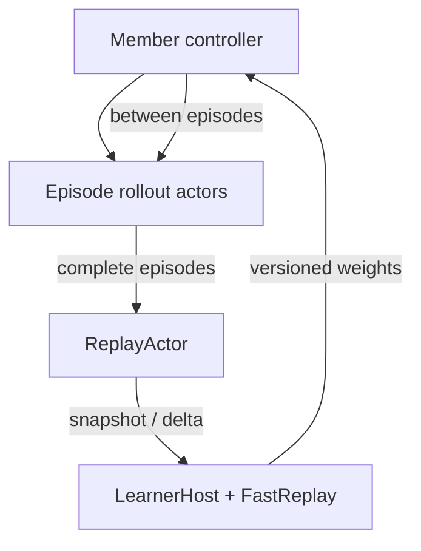
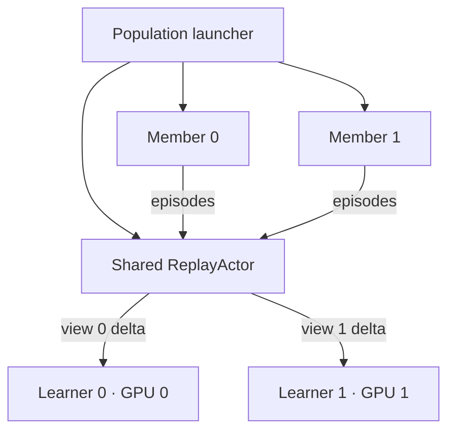

# `rllib-async-runtime`: подробный план реализации

**Статус:** Phase 0–2 реализованы; следующий этап — learner-local `FastReplay`

**Дата фиксации:** 24 июля 2026

**Рекомендуемый GitHub-репозиторий:** `TovarnovM/rllib-async-runtime`

**Имя Python-пакета:** `rllib_async`

**Рабочее название первой версии:** `v0.1 — Async SAC runtime`
**Поддерживаемая среда разработки:** repository-owned Dev Container

---

## 1. Итоговое решение

Проект реализуется не как ещё один самостоятельный RL-фреймворк и не как
повторная реализация SAC/DQN, а как тонкий Ray-native runtime поверх нового
RLlib API stack.

Разделение ответственности:

| Слой | Ответственность |
|---|---|
| Ray Core | акторы, RPC, планирование ресурсов, backpressure, placement |
| RLlib | `RLModule`, `MultiRLModule`, SAC learner/loss, target networks, connectors, episode abstractions |
| Ray Tune | trials, метрики, checkpoints, в будущем PBT scheduler |
| Этот проект | асинхронный execution loop, общий episode replay, learner-local replay, версии весов, population topology |

Центральная архитектурная идея:

> **Authoritative episode store + learner-specific materialized replay views.**

Целый эпизод является единицей:

- commit;
- дедупликации;
- удаления;
- синхронизации;
- checkpoint/recovery;
- смены версии весов rollout worker.

Но единицей uniform sampling для SAC остаётся **transition**, а не эпизод.

---

## 2. Зафиксированные ограничения

Эти решения считаются частью контракта `v0.1` и не должны незаметно меняться
во время реализации.

1. Только PyTorch.
2. Первый основной алгоритм — Async SAC.
3. Используется новый RLlib API stack.
4. Один environment на одном rollout actor.
5. Vector environments не поддерживаются.
6. Rollout actor заканчивает полный эпизод до смены весов.
7. Для бесконечных сред обязателен `max_episode_steps` и time-limit truncation.
8. Authoritative replay хранит только целые завершённые или усечённые эпизоды.
9. Replay payload может быть Python object graph с `dict`, списками и
   NumPy-массивами.
10. Произвольные неописанные Python-объекты не допускаются: payload обязан
    соответствовать версионированной схеме и codec-контракту.
11. У каждого learner/member есть собственный `FastReplay`.
12. `FastReplay` материализуется из snapshot/delta общего `ReplayActor`.
13. В `v0.1` authoritative replay использует FIFO retention.
14. В core MVP используется uniform transition sampling.
15. Prioritized replay и DQN не входят в core MVP.
16. Learner размещается на одной ноде и использует одну GPU.
17. Multi-node data-parallel learner не поддерживается.
18. Весы rollout worker обновляются только между эпизодами.
19. Все эпизоды помечаются producer/member ID и behavior weights version.
20. Две «PBT-особи» в `v0.1` — это topology smoke test без exploit/explore.
21. Hierarchy и GNN входят в `v0.1` как интеграционные примеры, а не как
    обещание production-ready универсальной MARL-системы.
22. Вся локальная разработка — установка зависимостей, запуск тестов, lint,
    примеров и debugger — выполняется внутри repository-owned devcontainer.
    Host Python и отдельный host `venv` не являются поддерживаемой средой.
23. На host остаются только Docker с Dev Containers, Git/редактор и, для GPU,
    NVIDIA driver с NVIDIA Container Toolkit. Кластерные запуски не обязаны
    выполняться через VS Code Dev Containers, но должны использовать тот же
    зафиксированный Python dependency set.

---

## 3. Что считается MVP

Запрошенный объём логически делится на два уровня.

### 3.1. Core MVP

Core MVP должен доказать, что основная архитектура работает:

- `AsyncSAC`;
- single-agent continuous-control environment;
- 4–16 episode rollout actors;
- один authoritative `ReplayActor`;
- episode-level commit/eviction/snapshot/delta;
- learner-local `FastReplay`;
- uniform sampling по transitions;
- один `LearnerHost`;
- один локальный RLlib `LearnerGroup` с одной GPU;
- versioned weight propagation между эпизодами;
- Tune-compatible reporting;
- learner checkpoint и восстановление;
- измеряемый backpressure;
- CPU correctness test и GPU integration test.

### 3.2. Обязательные демонстраторы `v0.1`

После прохождения core gates добавляются:

1. Два population members:
   - две GPU;
   - по одному learner на member;
   - по N собственных rollout actors;
   - один общий authoritative replay;
   - независимые weights, optimizer state и `FastReplay`.
2. Hierarchy example:
   - `manager`;
   - `worker_0`;
   - `worker_1`;
   - manager выбирает активную нижнеуровневую policy.
3. Shared-GNN example:
   - несколько однородных логических агентов;
   - одна shared policy;
   - один общий по весам GNN encoder;
   - variable-size graph observations;
   - один batched forward на policy/module, а не отдельная модель на агента.

### 3.3. Не входит в `v0.1`

- DQN;
- prioritized replay;
- настоящий PBT scheduler с exploit/explore;
- replay sharding;
- multi-node learner;
- vector env;
- recurrent policies;
- sequence replay, burn-in;
- offline dataset ingestion;
- один глобальный GNN forward сразу на 1000+ агентов;
- собственная реализация SAC loss;
- guarantees exactly-once при полном падении кластера;
- production object storage для replay checkpoints;
- Kubernetes/KubeRay;
- web UI.

---

## 4. Базовая топология

### 4.1. Одна особь



### 4.2. Две особи с общим replay



---

## 5. Компоненты и их контракты

## 5.1. `EpisodeEnvelope`

`EpisodeEnvelope` — единственный объект, который authoritative replay принимает
на commit.

Минимальная схема:

```python
@dataclass(frozen=True, slots=True)
class EpisodeEnvelope:
    episode_id: str
    schema_version: int
    producer_member_id: str
    runner_id: str
    runner_generation: int
    local_episode_seq: int
    behavior_versions: dict[str, int]
    env_steps: int
    agent_steps: int
    terminated: bool
    truncated: bool
    estimated_bytes: int
    payload: object
```

Требования:

- `episode_id` идемпотентен;
- рекомендуемый формат:
  `member_id/runner_id/runner_generation/local_episode_seq`;
- `payload` immutable после commit;
- `behavior_versions` содержит version для каждой policy/module, которая
  участвовала в эпизоде;
- один module не может менять version внутри эпизода;
- `estimated_bytes` проверяется и позднее может уточняться actor’ом;
- `schema_version` проверяется до помещения в store.

Для single-agent payload предпочтительно основывать на RLlib
`SingleAgentEpisode`. Для hierarchy/MARL — на `MultiAgentEpisode` либо на
минимальном adapter-контракте, если прямое использование RLlib episode окажется
несовместимым с fast sampling.

Это решение должно быть подтверждено compatibility spike, а не принято по
догадке.

## 5.2. `EpisodeCodec`

Codec отделяет хранение Python objects от алгоритма:

```python
class EpisodeCodec(Protocol):
    schema_version: int

    def validate(self, episode: EpisodeEnvelope) -> None: ...
    def transition_count(self, episode: EpisodeEnvelope) -> int: ...
    def get_transition(self, episode: EpisodeEnvelope, index: int) -> object: ...
    def estimate_bytes(self, episode: EpisodeEnvelope) -> int: ...
```

На первом этапе нужны два codec:

- `FlatEpisodeCodec` для обычного continuous-control env;
- `GraphEpisodeCodec` для GNN example.

Нельзя добавлять registry/plugins до появления третьего реального codec.

## 5.3. `ReplayActor`

Ответственность:

- atomic commit целого эпизода;
- дедупликация по `episode_id`;
- FIFO retention;
- лимиты по agent transitions и приблизительным байтам;
- authoritative manifest;
- журнал мутаций;
- snapshot;
- delta по cursor;
- общие replay metrics.

Минимальный API:

```python
commit_episode(episode: EpisodeEnvelope) -> CommitAck
get_delta(cursor: ReplayCursor, max_bytes: int) -> ReplayDelta
get_snapshot(max_bytes: int | None = None) -> ReplaySnapshot
get_stats() -> ReplayStats
save_snapshot(path: str) -> ReplayCheckpoint
load_snapshot(path: str) -> ReplayStats
```

Cursor:

```python
@dataclass(frozen=True, slots=True)
class ReplayCursor:
    store_generation: str
    mutation_seq: int
```

Правила delta:

- каждая commit-транзакция получает монотонный `mutation_seq`;
- одна транзакция содержит добавление и все вызванные им eviction;
- learner применяет транзакцию атомарно;
- `get_delta` имеет ограничение `max_bytes`;
- если cursor относится к другой generation или журнал уже compacted,
  возвращается `full_resync_required=True`;
- отсутствие новых данных — нормальный результат, не ошибка.

Retention:

- основная capacity задаётся в agent transitions;
- дополнительный hard limit задаётся в estimated bytes;
- удаляются только целые старейшие эпизоды;
- один эпизод больше hard limit должен быть отклонён явной ошибкой;
- eviction не должен оставлять learner в состоянии, где индекс ссылается на
  уже удалённый payload.

В `v0.1` payload можно хранить непосредственно в памяти actor’а. Переход к
отдельным immutable object-store blobs допускается только после profiling,
поскольку он усложняет ownership, recovery и checkpoint semantics.

## 5.4. `FastReplay`

Каждый `LearnerHost` владеет собственным `FastReplay`.

Ответственность:

- начальная материализация snapshot;
- периодическое применение delta;
- локальный payload store;
- собственный sampling index;
- uniform transition sampling;
- подготовка данных для collator;
- собственный cursor;
- собственные будущие TD priorities;
- статистика freshness и lag.

Нельзя делать полную вторую копию `FastReplay` при каждом delta. Нужны:

- один payload map;
- новый sampling index, строящийся в фоне;
- atomic swap ссылки на готовый индекс;
- deferred reclamation удалённых payload после завершения текущих readers.

Uniform sampling:

1. Пусть длины эпизодов равны `n_1, ..., n_k`.
2. Строится cumulative index по всем transitions.
3. Выбирается uniform integer `u` из `[0, sum(n_i))`.
4. `searchsorted` определяет episode и timestep.

Тогда каждый transition имеет вероятность:

```text
P(episode=i, timestep=t) = 1 / sum(n_i)
```

Нельзя сначала uniform выбирать эпизод, а затем timestep: это завысит вес
коротких эпизодов.

## 5.5. `BatchCollator`

```python
class BatchCollator(Protocol):
    def collate(self, transitions: Sequence[object]) -> LearnerBatch: ...
```

Реализации `v0.1`:

- `FlatBatchCollator`;
- `GraphBatchCollator`;
- `MultiModuleBatchCollator` для hierarchy example.

Pinned memory применяется только к уже собранному tensor batch. Произвольный
Python replay нельзя считать pinned или zero-copy.

## 5.6. `LearnerHost`

Один Ray actor на population member. Actor резервирует одну GPU и владеет:

- локальным `FastReplay`;
- RLlib SAC `LearnerGroup` с локальным learner;
- batch builder;
- bounded queue готовых CPU/pinned batches;
- CUDA prefetch;
- learner counters;
- weight registry;
- checkpoint state.

Логические процессы:

1. replay-sync loop;
2. batch-build loop;
3. GPU update loop;
4. metrics aggregation;
5. weight publication.

Порядок реализации:

- сначала детерминированный `tick()` без фоновых потоков;
- после прохождения correctness tests — bounded background loops;
- actor RPC не должен выполнять бесконечный blocking loop;
- `start()`, `pause()`, `drain()`, `stop()` должны быть явными lifecycle
  операциями.

Hot path learner не должен делать RPC на каждый transition или каждый tensor.
Delta подтягивается крупными порциями, а batch строятся локально.

## 5.7. Episode rollout actor

Rollout actor:

- содержит ровно один env;
- собирает один полный эпизод за вызов;
- использует одну behavior version на module в течение эпизода;
- возвращает `EpisodeEnvelope` и rollout metrics;
- не управляет replay retention;
- получает новые weights только между вызовами;
- поддерживает `max_episode_steps`;
- имеет `runner_generation`, увеличиваемый после restart.

Контроллер держит не более одного активного collection call на actor.
После завершения:

1. эпизод отправляется в `ReplayActor`;
2. actor при необходимости получает свежие weights;
3. немедленно запускается следующий episode;
4. число pending commits ограничено high watermark.

Глобального барьера между rollout actors нет.

## 5.8. Версии весов

```python
@dataclass(frozen=True, slots=True)
class WeightsDescriptor:
    member_id: str
    module_versions: dict[str, int]
    learner_updates: int
    published_at_monotonic: float
    state: object
```

Правила:

- version монотонна внутри member/module;
- rollout actor запрашивает weights только между эпизодами;
- старый ответ не может заменить более новую локальную version;
- episode сохраняет фактически использованную version;
- checkpoint сохраняет module, critics, targets, optimizer, SAC alpha и
  counters;
- публикация weights происходит с конфигурируемым интервалом, а не после
  каждого gradient update.

## 5.9. Member controller и Tune

Предпочтительный orchestration слой — один Tune-compatible controller на
member.

На compatibility phase надо сравнить два варианта:

1. наследник RLlib `Algorithm`;
2. тонкий `tune.Trainable`, который композиционно создаёт RLlib components.

Критерий выбора:

- не создаются дублирующие локальные EnvRunner/Learner;
- checkpoint API остаётся стандартным для Tune;
- можно явно управлять actor lifecycle;
- execution loop не зависит от синхронного `SAC.training_step()`.

**Предварительный выбор:** `tune.Trainable` с композиционным использованием
RLlib `SACConfig`, `RLModule` и `LearnerGroup`. Это проще и не создаёт второй
неиспользуемый control plane. Если compatibility spike покажет, что
`Algorithm` даёт то же без лишних компонентов, решение можно пересмотреть и
зафиксировать отдельным ADR.

---

## 6. Checkpoint и восстановление

Checkpoint делится на три уровня.

### 6.1. Member checkpoint

Сохраняется часто:

- actor module weights;
- critic weights;
- target networks;
- optimizer state;
- SAC alpha/temperature state;
- hyperparameters;
- counters;
- published weight versions;
- replay cursor;
- RNG states, где это практически возможно.

### 6.2. Population replay checkpoint

Сохраняется реже:

- store generation;
- mutation sequence;
- authoritative manifest;
- все retained episodes;
- retention configuration;
- schema versions;
- deduplication state.

### 6.3. Learner-local `FastReplay`

Не сохраняется. После restore он строится заново:

1. из population replay snapshot;
2. затем догоняется delta;
3. learner начинает GPU updates только после `learning_starts` threshold.

Ограничение `v0.1`: replay checkpoint предполагает локальную или общую
POSIX-compatible файловую систему, доступную actor’у. S3/GCS и произвольный
distributed storage откладываются.

Recovery semantics:

- duplicate episode commit безопасен;
- падение runner не портит committed episodes;
- после падения runner generation меняется;
- replay actor восстанавливается из последнего snapshot;
- данные после последнего snapshot могут быть потеряны;
- exactly-once cluster-wide recovery не обещается.

---

## 7. Backpressure и отсутствие простоев

Нельзя математически гарантировать нулевые простои producer и consumer при
несогласованных средних скоростях.

Условия устойчивой работы:

```text
replay_commit_capacity >= rollout_generation_rate
batch_build_capacity   >= GPU_batch_consumption_rate
```

Механизмы:

- один активный sample call на rollout actor;
- bounded pending commit queue;
- high/low watermark;
- backpressure только на границе эпизода;
- learner продолжает работать на текущем active replay view во время sync;
- bounded batch queue;
- delta загружается крупными порциями;
- ограничение размера одного delta;
- явный full resync при чрезмерном lag;
- никакого бесконечного накопления `ObjectRef`.

Поведение при перегрузке:

| Состояние | Действие |
|---|---|
| pending commits выше high watermark | временно не запускать новые episodes на части runners |
| batch queue пуста | учитывать learner data wait; GPU loop ждёт с bounded timeout |
| delta lag растёт | увеличить sync budget/частоту, затем при необходимости full resync |
| object store spilling | уменьшить pending RPC и replay transfer chunk |
| authoritative replay переполнен | FIFO eviction целых эпизодов |
| learner медленнее target UTD | снижать target UTD, а не бесконечно растить очередь |

---

## 8. Обязательные метрики

### Rollout

- `rollout/episodes_total`;
- `rollout/env_steps_per_s`;
- `rollout/agent_steps_per_s`;
- `rollout/episode_time_ms_p50/p95`;
- `rollout/policy_version_lag_p50/p95`;
- `rollout/pending_sample_calls`;
- `rollout/pending_episode_commits`;
- `rollout/backpressure_fraction`.

### Authoritative replay

- `replay/episodes`;
- `replay/env_steps`;
- `replay/agent_steps`;
- `replay/estimated_bytes`;
- `replay/commits_per_s`;
- `replay/duplicate_commits`;
- `replay/evictions`;
- `replay/delta_bytes_per_s`;
- `replay/snapshot_time_s`;
- `replay/rejected_oversize_episodes`.

### Learner-local replay

- `fast_replay/episodes`;
- `fast_replay/transitions`;
- `fast_replay/delta_lag_mutations`;
- `fast_replay/delta_lag_agent_steps`;
- `fast_replay/full_resyncs`;
- `fast_replay/index_rebuild_ms`;
- `fast_replay/materialized_bytes`.

### Learner

- `learner/updates_per_s`;
- `learner/samples_per_s`;
- `learner/update_to_data_ratio`;
- `learner/batch_build_ms_p50/p95`;
- `learner/gpu_update_ms_p50/p95`;
- `learner/batch_queue_depth`;
- `learner/batch_queue_empty_fraction`;
- `learner/data_wait_fraction`;
- `learner/weights_version`;
- стандартные SAC losses и entropy/alpha metrics.

GPU utilization можно собирать как дополнительную системную метрику, но нельзя
использовать её как единственный признак качества replay pipeline: маленькая
сеть может не загружать GPU даже при всегда готовых batch.

---

## 9. Repository layout

```text
rllib-async-runtime/
├── .devcontainer/
│   ├── devcontainer.json
│   └── Dockerfile
├── .github/
│   └── workflows/
│       └── ci.yml
├── docs/
│   ├── ARCHITECTURE.md
│   ├── IMPLEMENTATION_PLAN.md
│   └── adr/
│       ├── 0001-runtime-boundary.md
│       ├── 0002-episode-replay-quantum.md
│       ├── 0003-authoritative-and-reference-replay.md
│       └── 0004-replay-actor-checkpoint.md
├── examples/
│   ├── async_sac_pendulum.py
│   ├── population_two_members.py
│   ├── hierarchy_three_policies.py
│   └── shared_gnn_multiagent.py
├── benchmarks/
│   ├── replay_ingest.py
│   ├── fast_replay_sampling.py
│   └── end_to_end_throughput.py
├── src/
│   └── rllib_async/
│       ├── __init__.py
│       ├── config.py
│       ├── protocols/
│       │   ├── episodes.py
│       │   ├── replay.py
│       │   ├── weights.py
│       │   └── metrics.py
│       ├── replay/
│       │   ├── actor.py
│       │   ├── retention.py
│       │   ├── fast.py
│       │   └── sampling.py
│       ├── runners/
│       │   ├── episode_runner.py
│       │   └── runner_group.py
│       ├── learner/
│       │   ├── host.py
│       │   ├── sac_adapter.py
│       │   ├── batch_pipeline.py
│       │   └── collators.py
│       ├── runtime/
│       │   ├── member.py
│       │   ├── trainable.py
│       │   └── population.py
│       ├── checkpointing/
│       │   └── state.py
│       └── gnn/
│           ├── encoder.py
│           └── graph_batch.py
├── tests/
│   ├── unit/
│   ├── integration/
│   ├── gpu/
│   └── stress/
├── .gitignore
├── LICENSE
├── README.md
└── pyproject.toml
```

Правила:

- `src` layout;
- devcontainer — единственная поддерживаемая локальная dev-среда;
- один `Dockerfile` и один `devcontainer.json`; `docker-compose.yml` не
  добавляется, пока проекту действительно не потребуется несколько сервисов;
- команды в README по умолчанию выполняются в terminal devcontainer; host-команды
  должны быть явно помечены;
- никакой бизнес-логики в examples;
- никаких training artifacts/checkpoints в git;
- никакой сложной plugin architecture в `v0.1`;
- Protocol/dataclass вводится только там, где уже есть минимум две реализации
  или где контракт проходит Ray process boundary;
- код алгоритмического SAC loss не копируется из RLlib.

---

## 10. Версии и reproducibility

Начальная baseline:

- Linux x86_64;
- Python 3.11;
- Ray/RLlib `2.56.1`;
- новый RLlib API stack;
- PyTorch `2.7.0`;
- CPU wheel в CI и CUDA 11.8 wheel в GPU devcontainer;
- Gymnasium environments для smoke tests;
- `pyproject.toml`;
- единый `uv.lock` с взаимоисключающими extras `cpu` и `cu118`.

Выбор сделан после проверки целевой workstation: две RTX 3090, NVIDIA driver
`550.144.03`, максимальная поддерживаемая CUDA `12.4`. Ray 2.56.1 тестируется с
PyTorch 2.7.0, но его более новые CUDA wheels требуют более нового driver.
CUDA 11.8 wheel сохраняет версию PyTorch из baseline Ray и совместим с
имеющимся driver. Фактический доступ к обеим GPU остаётся отдельным
devcontainer gate на целевой workstation.

### Контракт devcontainer

- `.devcontainer/Dockerfile` задаёт Linux userspace и Python 3.11;
- `.devcontainer/devcontainer.json` собирает этот image, открывает корень
  репозитория и на GPU workstation передаёт доступные NVIDIA GPU;
- зависимости проекта устанавливаются из `pyproject.toml`/lock-файла в
  editable mode внутри container;
- container не содержит NVIDIA kernel driver: driver остаётся на host и
  передаётся через NVIDIA Container Toolkit;
- чистый `Rebuild and Reopen in Container` не требует ручной установки Python,
  Ray, PyTorch, `ruff` или `pytest`;
- настройки IDE ограничиваются Python, debugger и Ruff; лишние расширения и
  пользовательские dotfiles не становятся неявной частью сборки;
- все команды разработки в документации предполагают shell внутри
  devcontainer; исключения вроде создания репозитория и проверки Docker
  помечаются как host-команды.

Devcontainer — контракт локальной разработки, а не формат production deploy.
Ray cluster/container packaging для запуска задач будет определён отдельно.

CI:

- CPU-only GitHub Actions;
- Python 3.11;
- `ruff check`;
- `ruff format --check`;
- `pytest -m "not gpu and not cluster and not stress"`;
- GPU tests запускаются отдельно на реальном Ray cluster;
- type checker добавляется после стабилизации RLlib adapter boundary, чтобы
  не тратить первый этап на подавление внешних incomplete stubs.
- CI устанавливает тот же зафиксированный dependency set, что и devcontainer;
  отдельного второго списка зависимостей для CI не создаётся.

Лицензия: **Apache-2.0**, как у Ray. В README обязательно написать:

> Experimental project built on Ray/RLlib; not an official Ray project.

---

## 11. Поэтапная реализация

## Phase 0. Создание репозитория и compatibility spike

### Задачи

1. Создать пустой public GitHub repository.
2. Добавить `.devcontainer/Dockerfile` и `.devcontainer/devcontainer.json`.
3. Добавить минимальный `pyproject.toml`, lock-файл, README, Apache-2.0, CI.
4. Зафиксировать Python 3.11 и Ray 2.56.1.
5. Проверить чистый build/rebuild devcontainer и editable install проекта.
6. Проверить на реальном коде:
   - создание SAC `RLModule`;
   - создание локального `LearnerGroup`;
   - один update на фиксированном batch;
   - полный state/checkpoint learner;
   - создание одного RLlib EnvRunner без vector env;
   - получение полного episode;
   - применение новых weights перед следующим episode.
7. Сравнить `Algorithm` и `tune.Trainable` как orchestration base.
8. Зафиксировать решение ADR.

### Критерии готовности

- чистый clone открывается и собирается через `Rebuild and Reopen in Container`;
- внутри devcontainer используется Python 3.11 и editable install проекта;
- lint, CPU tests и compatibility harness запускаются без host Python/venv;
- при наличии NVIDIA Container Toolkit CUDA-enabled PyTorch внутри
  devcontainer видит ожидаемый набор GPU;
- CPU test создаёт SAC learner и выполняет update;
- GPU smoke test внутри Ray learner actor видит ровно одну выделенную GPU;
- fixed batch даёт конечные losses;
- state round-trip восстанавливает module, target networks, optimizer и alpha;
- runner выдаёт полный episode;
- в процессе не создаются скрытые дополнительные env runners или learners;
- выбранный orchestration base зафиксирован ADR.

### Stop condition

Если RLlib 2.56.1 не позволяет переиспользовать SAC learner без копирования
существенной части алгоритмического кода, проект не продолжает архитектуру
вслепую. Сначала документируется конкретный API gap и выбирается минимальный
adapter.

---

## Phase 1. Контракты и in-process reference replay

### Задачи

1. Реализовать dataclasses/protocols.
2. Реализовать `FlatEpisodeCodec`.
3. Реализовать обычный in-process `EpisodeStore`.
4. Реализовать FIFO retention.
5. Реализовать snapshot/delta/cursor без Ray actor.
6. Реализовать deterministic reference `FastReplay`.
7. Реализовать uniform transition sampler.

### Критерии готовности

- property tests для произвольных add/evict;
- duplicate commit не меняет store;
- delayed duplicate commit остаётся no-op после FIFO eviction;
- oversize episode отклоняется;
- snapshot + все последующие delta дают точное состояние store;
- stale cursor требует full resync;
- statistical test не обнаруживает перекоса к коротким эпизодам;
- schema mismatch завершается явной ошибкой.

---

## Phase 2. Ray `ReplayActor`

### Задачи

1. Обернуть проверенный store в Ray actor.
2. Добавить bounded delta response.
3. Добавить actor metrics.
4. Добавить snapshot save/load.
5. Добавить concurrency/load test с несколькими producers.
6. Проверить поведение при duplicate delivery.

### Критерии готовности

- 16 concurrent producers не нарушают manifest;
- commit acknowledgement однозначен;
- один episode виден либо целиком, либо не виден;
- retained payload и mutation journal ограничены capacity при длительном FIFO
  test;
- monotonic deduplication metadata измеряется отдельно; полная стабилизация RSS
  не заявляется до выбора generation rotation или bounded retry contract;
- snapshot restore воспроизводит manifest и payload;
- replay не выполняет batch sampling.

---

## Phase 3. Learner-local `FastReplay`

### Задачи

1. Реализовать snapshot bootstrap.
2. Реализовать delta sync.
3. Реализовать active sampling index.
4. Реализовать background index rebuild.
5. Реализовать atomic swap.
6. Реализовать bounded batch queue.
7. Реализовать `FlatBatchCollator`.

### Критерии готовности

- после любой допустимой последовательности delta local manifest совпадает с
  authoritative;
- sampler не возвращает evicted transitions;
- sampling может продолжаться во время index rebuild;
- payload не дублируется полностью на каждый rebuild;
- queue никогда не растёт выше configured bound;
- metrics показывают delta lag и data wait.

---

## Phase 4. RLlib SAC learner adapter

### Задачи

1. Реализовать `SACLearnerAdapter`.
2. Преобразовать collated batch в точный формат RLlib learner.
3. Реализовать learning-start threshold.
4. Реализовать target update semantics через RLlib.
5. Реализовать publication interval весов.
6. Реализовать полный member checkpoint.
7. Сравнить fixed-batch updates со стандартным RLlib SAC.

### Критерии готовности

- parity losses на фиксированном batch в заданном numerical tolerance;
- target network update совпадает по расписанию;
- alpha/temperature обновляется и восстанавливается;
- optimizer state действительно восстанавливается;
- adapter не содержит собственной копии SAC loss;
- после restore следующий update согласован с контрольным run.

---

## Phase 5. Episode rollout и versioned weights

### Задачи

1. Реализовать one-env episode runner.
2. Реализовать асинхронную группу 4–16 actors.
3. Реализовать version check между эпизодами.
4. Реализовать idempotent episode IDs.
5. Реализовать pending commit watermarks.
6. Реализовать runner restart generation.

### Критерии готовности

- ни один episode не содержит две версии одной module;
- быстрый runner не ждёт медленный runner;
- нет глобального episode barrier;
- duplicate delivery не создаёт duplicate data;
- policy lag измеряется;
- restart runner не создаёт collision episode ID;
- backpressure включается только на границе эпизода.

---

## Phase 6. Single-member Async SAC

### Задачи

1. Соединить controller, runners, replay и learner.
2. Реализовать event pump.
3. Реализовать Tune reporting interval.
4. Реализовать graceful pause/drain/stop.
5. Добавить correctness example на `Pendulum-v1`.
6. Добавить synthetic throughput environment.
7. Добавить evaluation runners, не пишущие в training replay.

### Критерии готовности

- один CLI/example запускает полный training run;
- training на `Pendulum-v1` демонстрирует улучшение evaluation return;
- evaluation использует frozen published weights;
- после warm-up learner не ждёт authoritative replay на каждом update;
- pending RPC ограничены;
- process останавливается без orphan actors;
- метрики всех четырёх слоёв появляются в Tune result.

Важно: learning-curve parity со стандартным SAC оценивается статистически по
нескольким seeds. Побитовое совпадение для асинхронного runtime не ожидается.

---

## Phase 7. Checkpoint/recovery

### Задачи

1. Member checkpoint.
2. Replay snapshot.
3. Restore `FastReplay` из authoritative state.
4. Runner recreation.
5. Controlled crash tests.

### Критерии готовности

- learner state восстанавливается полностью;
- fast replay не сериализуется в member checkpoint;
- после restore он строится из snapshot/delta;
- duplicate re-delivery после crash безопасна;
- документирован допустимый объём потери replay после последнего snapshot;
- Tune может продолжить trial из checkpoint.

---

## Phase 8. Две особи, две GPU, один replay

### Задачи

1. Population launcher создаёт один named/detached `ReplayActor`.
2. Tune запускает два fixed-config members без PBT scheduler.
3. Каждый member создаёт:
   - один `LearnerHost`;
   - одну GPU;
   - N rollout actors;
   - собственный `FastReplay`;
   - собственный weight namespace.
4. Оба member читают общий uniform replay.
5. Добавить producer composition metrics.

### Критерии готовности

- физически используются две GPU;
- оба members одновременно выполняют updates;
- оба видят episodes обоих `producer_member_id`;
- weights и optimizer state независимы;
- exploit/explore не выполняется;
- остановка одного member не останавливает второй;
- replay создаётся ровно один раз;
- population checkpoint не копирует replay в каждый trial.

---

## Phase 9. Hierarchy example

### Семантика

- manager действует раз в `K` environment steps;
- manager выбирает `worker_0` или `worker_1`;
- активный worker выдаёт tactical action;
- неактивный worker отсутствует из observation/action turn;
- episode хранит `env_t`, `agent_t`, `agent_id`, `module_id`;
- `FastReplay` строит module-specific batch views.

### Риск

Manager имеет естественное `Discrete(2)` action space, тогда как lower-level
workers удобно делать continuous SAC policies. Не нужно скрывать эту
неоднородность искусственной архитектурой.

Порядок решения:

1. На Phase 0 проверить discrete SAC и heterogeneous `MultiRLModule` в
   зафиксированном RLlib.
2. Если поддержка достаточна — использовать её.
3. Если нет — для `v0.1` сделать явно помеченный continuous gate manager
   только как pipeline demo.
4. Настоящий `DQN manager + SAC workers` перенести в следующую версию после
   появления AsyncDQN.

### Критерии готовности

- три module действительно участвуют в episode;
- manager действует только на своей частоте;
- неактивный worker не создаёт фиктивные transitions;
- batches разделены по module;
- version metadata корректна для всех module;
- длительный smoke test не ломает replay/delta/checkpoint.

---

## Phase 10. Shared-GNN multi-agent example

### Зафиксированная трактовка

В `v0.1` «общий GNN encoder» означает:

- одна архитектура;
- одни shared trainable weights;
- один shared policy/module;
- каждый агент получает ego-centric graph;
- variable-size graphs объединяются collator’ом.

Это не означает один глобальный graph forward, вычисленный ровно один раз на
все 1000 агентов. Такой режим требует packed centralized runner и является
отдельным этапом.

Graph observation:

```python
{
    "node_features": np.ndarray,
    "edge_index": np.ndarray,
    "edge_features": np.ndarray | None,
    "controlled_node": int,
    "action_mask": np.ndarray | None,
}
```

`GraphBatchCollator` строит:

- concatenated node features;
- shifted edge indices;
- `graph_ptr`;
- controlled-node indices;
- optional masks.

Первый encoder реализуется на чистом PyTorch через `index_add_`/scatter-like
операции. PyTorch Geometric не становится обязательной зависимостью `v0.1`.

### Критерии готовности

- variable-size graphs корректно collate;
- gradients доходят до shared GNN weights;
- все agents используют один module state;
- agent ID не создаёт отдельную policy;
- batch forward выполняется по module;
- тесты покрывают пустые edges, один node и разные размеры graphs;
- long smoke test проходит checkpoint/restore.

---

## Phase 11. Performance gate и документация

### Матрица

- rollout actors: 1, 4, 8, 16;
- flat и nested/GNN payload;
- короткие и длинные эпизоды;
- один member и два members;
- разные batch size;
- разные target update-to-data ratio.

### Сравнения

1. Стандартный RLlib SAC.
2. Новый runtime без background batching.
3. Новый runtime с `FastReplay` и batch queue.

### Критерии готовности

- нет неограниченного роста pending refs/queues;
- authoritative replay memory следует capacity;
- learner data wait измерен, а не оценён на глаз;
- bottleneck определён профилированием;
- все команды запуска документированы;
- README ясно отделяет готовое от roadmap;
- известные ограничения перечислены.

---

## 12. Тестовая стратегия

### Unit

- episode validation;
- deduplication;
- FIFO retention;
- snapshot/delta equivalence;
- stale cursor;
- uniform transition sampling;
- sampling index swap;
- weight version comparison;
- batch collators;
- checkpoint state schema.

### Property/randomized

- случайные add/evict/snapshot/delta последовательности;
- повторная доставка commits;
- разные длины episodes;
- schema mismatch;
- cursor compaction;
- random graph sizes.

### Integration CPU

- Ray local cluster;
- 2–4 rollout actors;
- small replay;
- learner update на CPU;
- Tune report;
- pause/resume;
- checkpoint round-trip.

### Integration GPU

- single member/one GPU;
- two members/two GPU;
- pinned batch queue;
- checkpoint restore;
- GPU process placement.

### Stress

- 16 producers;
- длительный FIFO churn;
- artificial slow replay;
- artificial slow learner;
- replay actor restart;
- runner restart;
- long graph episodes.

Маркеры:

```text
unit
integration
gpu
cluster
stress
```

---

## 13. Основные риски

| Риск | Ранний индикатор | Реакция |
|---|---|---|
| RLlib learner API недостаточно отделён | приходится копировать SAC loss | остановить phase и написать минимальный adapter/RFC |
| ReplayActor — ingest bottleneck | pending commits и backpressure растут | сначала batching/profiling, затем object-store blobs или sharding |
| Python GNN payload дорог в сериализации | delta transfer доминирует wall time | нормализовать числовые листья, chunk delta, профиль codec |
| FastReplay расходует слишком много RAM | две materialized views не помещаются | capacity per member, compact payload, не копировать view на rebuild |
| GPU недогружена | data wait высокий | ускорить collator/prefetch, увеличить batch |
| GPU недогружена при нулевом data wait | update kernel слишком мал | увеличить model/batch; replay не оптимизировать без причины |
| Long episodes дают stale policy | version lag p95 растёт | max steps/truncation, короче episode semantics |
| Tune trials не видят named replay actor | namespace/lifecycle failure | population launcher integration test до PBT |
| Hierarchy расширяет scope | heterogeneous learner блокирует phase | оставить pipeline demo, DQN manager перенести |
| GNN example случайно требует centralized pass | число forwards растёт с agents | явно ограничить ego-graph shared-policy semantics |

---

## 14. Реалистичная оценка объёма

Это не двухнедельный проект, если выполнить все критерии, а не только собрать
демо.

Ориентир для одного разработчика:

| Объём | Оценка |
|---|---:|
| Phase 0–1: compatibility + contracts | 1–2 недели |
| Phase 2–6: рабочий single-member AsyncSAC | 3–5 недель |
| Phase 7–8: recovery + population topology | 1–2 недели |
| Phase 9–10: hierarchy + GNN examples | 2–3 недели |
| Phase 11: profiling/docs/hardening | 1–2 недели |

Итого:

- **core MVP:** примерно 4–7 недель;
- **весь запрошенный `v0.1`:** примерно 7–12 недель.

Это диапазон, а не обещание срока. Самая большая неопределённость — точная
граница повторного использования RLlib SAC learner и heterogeneous multi-module
поддержка hierarchy.

---

## 15. Организация GitHub-репозитория

Рекомендуемые параметры:

| Поле | Значение |
|---|---|
| Owner | `TovarnovM` |
| Repository name | `rllib-async-runtime` |
| Description | `Experimental Ray-native asynchronous off-policy runtime built on RLlib` |
| Visibility | Public |
| Template | None |
| Initialize README | No |
| Add `.gitignore` | No |
| License in GitHub wizard | No |

Репозиторий лучше создать пустым: README, `.gitignore`, Apache-2.0,
`pyproject.toml` и CI должны попасть в один осмысленный bootstrap commit.

После первого push:

- default branch: `main`;
- запрет force-push в `main`;
- запрет удаления `main`;
- require status checks;
- required review count: `0` для solo-разработки;
- squash merge включён;
- merge commits отключены;
- linear history включена;
- Issues включены;
- Wiki/Discussions/Projects пока отключены;
- Actions не получают write permissions без необходимости;
- checkpoints, datasets и benchmark outputs не хранятся в git.

В публичный режим переводить после:

- прохождения core MVP;
- очистки истории от credentials/cluster addresses;
- готового README;
- явного статуса experimental;
- проверки license notices.

---

## 16. Что пользователь должен сделать сейчас

1. Открыть GitHub → **New repository**.
2. Выбрать owner `TovarnovM`.
3. Ввести имя `rllib-async-runtime`.
4. Ввести description:

   ```text
   Experimental Ray-native asynchronous off-policy runtime built on RLlib
   ```

5. Выбрать **Public**.
6. Не добавлять README, `.gitignore` и license.
7. Создать репозиторий.
8. Передать ссылку на него в следующий Codex task/chat.
9. На машине, где будет открыт devcontainer, проверить host prerequisites и
   вместе со ссылкой передать вывод:

   ```bash
   docker version
   nvidia-smi
   ```

Host GPU и driver подтверждены. После bootstrap проверка Python, Ray, PyTorch и
CUDA выполняется внутри devcontainer; CPU compatibility tests могут быть
закрыты в CI, но GPU gate закрывается только на целевой workstation.

---

## 17. Первый Codex task после создания репозитория

Следующая задача должна быть ограничена **только Phase 0**:

> Подготовить bootstrap `TovarnovM/rllib-async-runtime`: Python 3.11,
> Ray/RLlib 2.56.1, repository-owned devcontainer, `src` layout, Apache-2.0,
> CPU CI, минимальные tests и compatibility harness. Вся локальная установка,
> разработка, lint, тесты и debug должны выполняться внутри devcontainer; не
> создавать и не документировать host `venv`. Проверить чистый rebuild
> devcontainer, создание SAC RLModule/LearnerGroup, fixed-batch update, learner
> state round-trip и one-env full-episode runner. Сравнить RLlib `Algorithm` и
> `tune.Trainable` как orchestration base, зафиксировать решение ADR. Не
> реализовывать ReplayActor, async loop, hierarchy или GNN на этом этапе.

Success criterion первого PR:

- чистая установка;
- чистый devcontainer build/rebuild;
- зелёный CPU CI;
- воспроизводимый compatibility test;
- зафиксированный orchestration decision;
- отсутствие production-кода, основанного на ещё не проверенном RLlib API.

---

## 18. Трекер

- [x] Архитектурная концепция согласована.
- [x] Границы core MVP и `v0.1` разделены.
- [x] Имя репозитория выбрано.
- [x] План реализации сформирован.
- [x] Репозиторий создан пользователем.
- [x] Phase 0 bootstrap PR.
- [x] Phase 1 contracts/reference replay.
- [x] Phase 2 Ray ReplayActor.
- [ ] Phase 3 FastReplay.
- [ ] Phase 4 SAC adapter.
- [ ] Phase 5 rollout/version sync.
- [ ] Phase 6 single-member AsyncSAC.
- [ ] Phase 7 checkpoint/recovery.
- [ ] Phase 8 two-member population.
- [ ] Phase 9 hierarchy example.
- [ ] Phase 10 shared-GNN example.
- [ ] Phase 11 performance gate/documentation.

---

## 19. Технические опоры

- [RLlib new API stack migration guide](https://docs.ray.io/en/latest/rllib/new-api-stack-migration-guide.html)
- [RLlib API reference](https://docs.ray.io/en/latest/rllib/package_ref/index.html)
- [RLlib Episodes](https://docs.ray.io/en/latest/rllib/single-agent-episode.html)
- [RLlib RLModule](https://docs.ray.io/en/latest/rllib/rl-modules.html)
- [Ray 2.56.1 release](https://github.com/ray-project/ray/releases/tag/ray-2.56.1)
